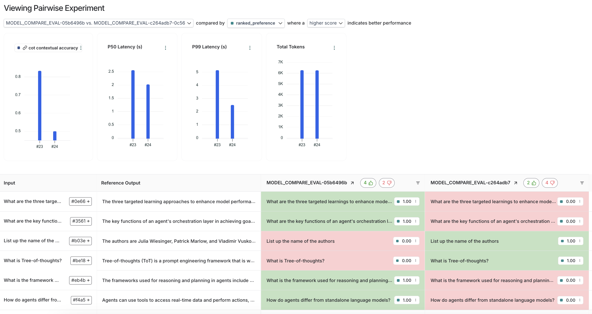

<style>
.custom {
    background-color: #008d8d;
    color: white;
    padding: 0.25em 0.5em 0.25em 0.5em;
    white-space: pre-wrap;       /* css-3 */
    white-space: -moz-pre-wrap;  /* Mozilla, since 1999 */
    white-space: -pre-wrap;      /* Opera 4-6 */
    white-space: -o-pre-wrap;    /* Opera 7 */
    word-wrap: break-word;
}

pre {
    background-color: #027c7c;
    padding-left: 0.5em;
}

</style>

# Pairwise Evaluation

- Author: [BokyungisaGod](https://github.com/BokyungisaGod)
- Design: 
- Peer Review: 
- This is a part of [LangChain Open Tutorial](https://github.com/LangChain-OpenTutorial/LangChain-OpenTutorial)

[](https://colab.research.google.com/github/LangChain-OpenTutorial/LangChain-OpenTutorial/blob/main/99-TEMPLATE/00-BASE-TEMPLATE-EXAMPLE.ipynb) [](https://github.com/LangChain-OpenTutorial/LangChain-OpenTutorial/blob/main/99-TEMPLATE/00-BASE-TEMPLATE-EXAMPLE.ipynb)

## Overview
In some evaluations, the goal is to compare the outputs of two or more LLMs.

This comparative evaluation method is commonly encountered on platforms like [Chatbot Arena](https://lmsys.org/blog/2023-05-03-arena/) or LLM leaderboards.

### Table of Contents

- [Overview](#overview)
- [Environment Setup](#environment-setup)
- [Pairwise evaluation](#pairwise-evaluation)

### References

- [LangChain](https://blog.langchain.dev/)
----

## Environment Setup

Setting up your environment is the first step. See the [Environment Setup](https://wikidocs.net/257836) guide for more details.


**[Note]**

The langchain-opentutorial is a package of easy-to-use environment setup guidance, useful functions and utilities for tutorials.
Check out the  [`langchain-opentutorial`](https://github.com/LangChain-OpenTutorial/langchain-opentutorial-pypi) for more details.

```python
%%capture --no-stderr
%pip install langchain-opentutorial
```

```python
# Install required packages
from langchain_opentutorial import package

package.install(
    [
        "langsmith",
        "langchain",
        "langchain_core",
        "langchain_openai",
    ],
    verbose=False,
    upgrade=False,
)
```

You can set API keys in a `.env` file or set them manually.

[Note] If you’re not using the `.env` file, no worries! Just enter the keys directly in the cell below, and you’re good to go.

```python
from dotenv import load_dotenv
from langchain_opentutorial import set_env

# Attempt to load environment variables from a .env file; if unsuccessful, set them manually.
if not load_dotenv():
    set_env(
        {
            "OPENAI_API_KEY": "",
            "LANGCHAIN_API_KEY": "",
            "LANGCHAIN_TRACING_V2": "true",
            "LANGCHAIN_ENDPOINT": "https://api.smith.langchain.com",
            "LANGCHAIN_PROJECT": "",  # set the project name same as the title
        }
    )
```

## Pairwise Evaluation

Now, you can generate a dataset from these example executions.

Only the inputs need to be saved.

```python
from langchain_openai import ChatOpenAI
from langchain_core.prompts import PromptTemplate
from langchain_core.output_parsers import StrOutputParser


def evaluate_pairwise(runs: list, example) -> dict:
    """
    A simple evaluator for pairwise answers to score based on engagement
    """

    # Save scores
    scores = {}
    for i, run in enumerate(runs):
        scores[run.id] = i

    # Execution pairs for each example
    answer_a = runs[0].outputs["answer"]
    answer_b = runs[1].outputs["answer"]
    question = example.inputs["question"]

    # LLM with function calls, using a high-performance model
    llm = ChatOpenAI(model="gpt-4o-mini", temperature=0)

    # Structured prompt
    grade_prompt = PromptTemplate.from_template(
        """
        You are an LLM judge. Compare the following two answers to a question and determine which one is better.
        Better answer is the one that is more detailed and informative.
        If the answer is not related to the question, it is not a good answer.
        
        # Question:
        {question}
        
        #Answer A: 
        {answer_a}
        
        #Answer B: 
        {answer_b}
        
        Output should be either `A` or `B`. Pick the answer that is better.
        
        #Preference:
        """
    )
    answer_grader = grade_prompt | llm | StrOutputParser()

    # Obtain scores
    score = answer_grader.invoke(
        {
            "question": question,
            "answer_a": answer_a,
            "answer_b": answer_b,
        }
    )
    # score = score["Preference"]

    # Map execution assignments based on scores
    if score == "A":  # Preference for Assistant A
        scores[runs[0].id] = 1
        scores[runs[1].id] = 0
    elif score == "B":  # Preference for Assistant B
        scores[runs[0].id] = 0
        scores[runs[1].id] = 1
    else:
        scores[runs[0].id] = 0
        scores[runs[1].id] = 0

    return {"key": "ranked_preference", "scores": scores}
```

Conduct a comparative evaluation.

```python
from langsmith.evaluation import evaluate_comparative

# Replace with an array of experiment names or IDs
evaluate_comparative(
    ["MODEL_COMPARE_EVAL-05b6496b", "MODEL_COMPARE_EVAL-c264adb7"],
    # Array of evaluators
    evaluators=[evaluate_pairwise],
)
```

<pre class="custom">View the pairwise evaluation results at:
    https://smith.langchain.com/o/9089d1d3-e786-4000-8468-66153f05444b/datasets/9b4ca107-33fe-4c71-bb7f-488272d895a3/compare?selectedSessions=33fa8084-b82f-45ee-a3dd-c374caad16e0%2Cf784a8c4-88ab-4a35-89a7-3aba5367f182&comparativeExperiment=f9b31d2e-299a-45bc-a61c-0c2622dbceac
    
    
</pre>


      0%|          | 0/6 [00:00<?, ?it/s]


    <langsmith.evaluation._runner.ComparativeExperimentResults at 0x105fc5bd0>



